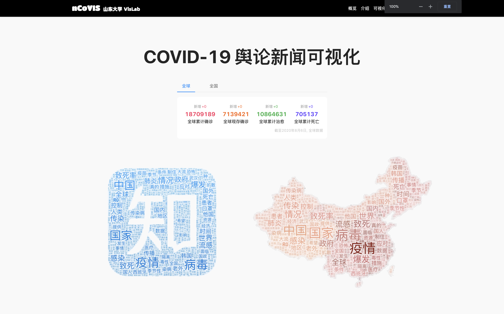
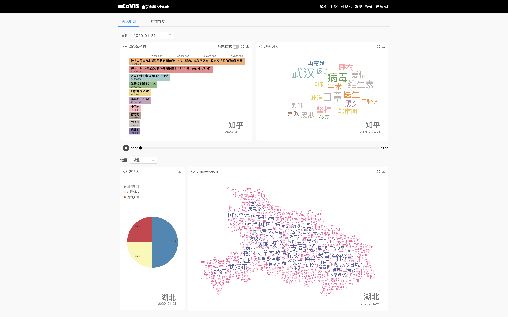
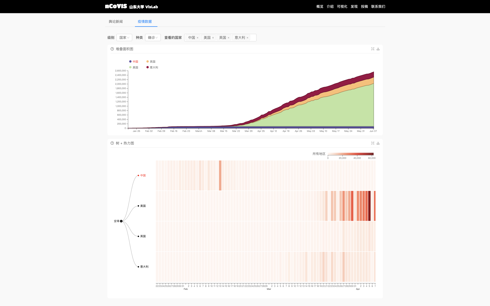

# ncovis-2020

ncovis-2020 分析系统参与了由中国计算机学会CAD&CG专委会、阿里云天池、机器之心、阿里云DataV、Datawhale联合发起的以“万众’疫’心 天池众智”为主题的疫情数据可视化公益行动，并且获得了**铜奖**。

ncovis-2020 是一个面向大众的可视化分析平台。该平台是山东大学 [VisLab](https://vislab.wang/) 成员在 COVID-19 病毒传播期间开发，用于分析疫情对舆论和新闻的影响。

## 介绍

具体的介绍和使用方法请移步网站。

- [国内](https://pearmini.gitee.io/ncovis-2020/)
- [国外](https://pearmini.github.io/ncovis-2020/)

## 技术栈

（1）前端：react + d3 + antd

（2）后端架构：[github](https://github.com/vivym/ncovis-api)

（3）可视化技术：使用了我们实验室在 **InfoVis2019** 发表的论文 [Shapwordle](https://vislab.wang/post/shapewordle:-tailoring-wordles-using-shape-aware-archimedean-spirals)，这里是 [github]( https://github.com/Kaiyiwing/Shape_Wordle) 的地址。

## 团队成员

- 前端和可视化：[pearmini](https://github.com/pearmini)
- 后端和爬虫：[vivym](https://github.com/vivym)
- 数据处理：[Kaiyiwing](https://github.com/Kaiyiwing)

## 感谢

mjrao 先生提供的部分[知乎数据](https://github.com/mjrao/hotso)。
